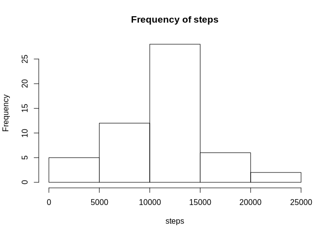
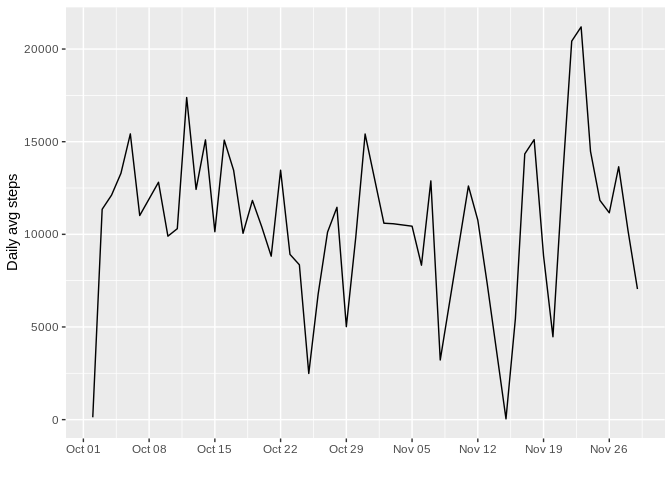
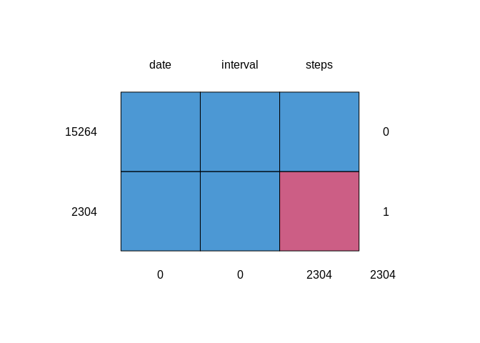
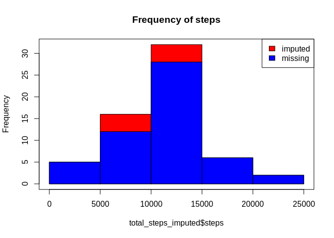
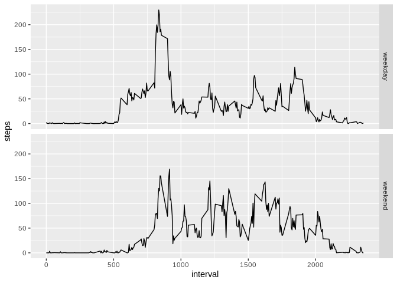

```
## Loading required package: lattice
```

```
## 
## Attaching package: 'mice'
```

```
## The following objects are masked from 'package:base':
## 
##     cbind, rbind
```

```
## Loading required package: grid
```


## Loading and preprocessing the data

```r
if(!file.exists("./data.zip")){
    download.file(url, "data.zip")
    unzip("data.zip",exdir=".")
}
df<- read.csv("activity.csv")
head(df)
```

```
##   steps       date interval
## 1    NA 2012-10-01        0
## 2    NA 2012-10-01        5
## 3    NA 2012-10-01       10
## 4    NA 2012-10-01       15
## 5    NA 2012-10-01       20
## 6    NA 2012-10-01       25
```

```r
dim(df)
```

```
## [1] 17568     3
```
## What is mean total number of steps taken per day?

```r
total_steps_per_day <- aggregate(steps ~ date, df, sum)
hist(total_steps_per_day$steps, xlab = "steps", main="Frequency of steps")
```

<!-- -->

```r
mean_steps <- mean(total_steps_per_day$steps, na.rm = TRUE)
median_steps <- median(total_steps_per_day$steps, na.rm = TRUE)
```

## What is the average daily activity pattern?

```r
ggplot(total_steps_per_day, aes(as.Date(date, format = "%Y-%m-%d"), steps)) + geom_line() + xlab("") + ylab("Daily avg steps") + scale_x_date(date_breaks = "1 weeks", date_labels = "%b %d")
```

<!-- -->
Average number of steps by interval and the interval which has maximum average steps

```r
by_interval <- aggregate(steps ~ interval, df, mean)
max_steps_interval <- by_interval[which.max(by_interval$steps),]
```

## Imputing missing values
Showing number of missing values

```r
md.pattern(df, plot=TRUE)
```

<!-- -->

```
##       date interval steps     
## 15264    1        1     1    0
## 2304     1        1     0    1
##          0        0  2304 2304
```
Imputing missing values using knn imputation

```r
imputedData <- knnImputation(df)
```

```r
total_steps_imputed <- aggregate(steps ~ date, imputedData, sum)
hist(total_steps_imputed$steps, col="red",main="Frequency of steps")
hist(total_steps_per_day$steps, xlab = "steps",col="blue", ylim=c(0,40),add = T)

legend("topright", c("imputed", "missing"), fill=c("red", "blue"))
box()
```

<!-- -->


## Are there differences in activity patterns between weekdays and weekends? 

```r
imputedData$week <- ifelse(!(weekdays(as.Date(imputedData$date)) %in% c("Saturday", "Sunday")),"weekday","weekend")
total_steps_interval <- aggregate(steps ~ interval+ week, imputedData, mean)
ggplot(total_steps_interval, aes(interval,steps)) + geom_line() + facet_grid(week ~ .)
```

<!-- -->
